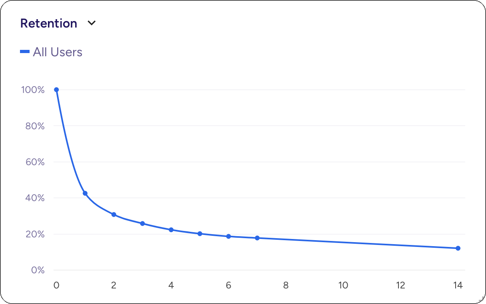
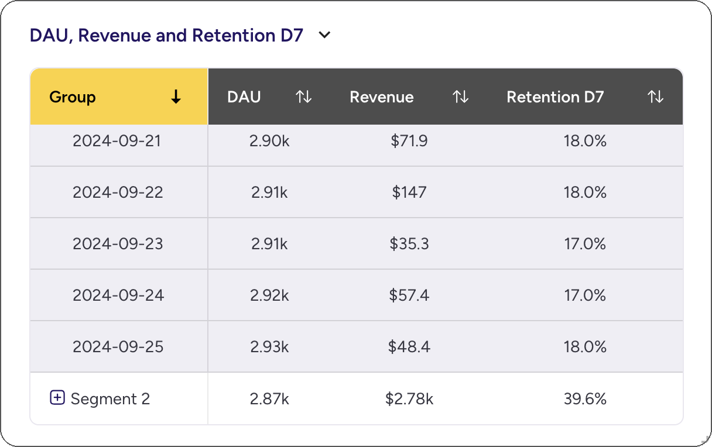

# Chart Types in Asemic

Asemic offers a variety of chart types to help you visualize your data effectively. This guide will introduce you to the available chart types and provide guidance on when to use each one.

## Line Chart

Line charts are ideal for showing trends over time or comparing multiple metrics.

**Use cases:**
- Tracking KPIs over time
- Comparing KPIs with past performance
- Comparing performance across different segments

{width=400px}

To create a line chart:
1. Click on Add Chart and select your KPI
2. That's it

## Bar Chart

Bar charts are great for comparing values across categories.

**Use cases:**
- Comparing revenue across product categories
- Visualizing user distribution by country
- Readable substitution for pie charts

{width=600px}

To create a bar chart:
1. Click on Add Chart
2. Select your KPI
3. Go to Full Edit Mode
4. Pick a Bar Chart in Visualization tab

## Cohort Chart

Cohort charts help you analyze how user behavior changes over time for different cohorts.

**Use cases:**
- Analyzing retention rates
- Comparing LTV for different acquisition cohorts
- Tracking User Journey over long periods of time for various metrics

{width=400px}

To create a cohort chart:
1. Click on Add Cohort Chart
2. Select your KPI with a tag `cohort`

## Funnel Chart

Funnel charts visualize user progression through a series of steps.

**Use cases:**
- Analyzing conversion rates through a purchase flow
- Identifying drop-off points in user onboarding

{width=400px}

To create a funnel chart:
1. Click on Add Funnel
2. Chart will be added and Full Edit Mode will be automatically opened
3. Define your funnel steps

## Table

Tables provide a detailed view of your data, allowing for precise comparisons and drill-downs.

**Use cases:**
- Detailed breakdowns of KPIs by multiple dimensions
- Exporting data for further analysis

{width=600px}

To create a table:
1. Click on Add Table
2. Select your KPIs

## Asemic's Layout Engine

Asemic's Layout Engine automatically selects the most appropriate chart type based on your data and analysis context. However, you can always override this selection and choose a different chart type if desired.

To change the chart type:
1. Click on the chart type icon in the top-right corner of your visualization
2. Go to Full Edit Mode
3. Go to Visualization tab

Remember, the best chart type depends on the story you're trying to tell with your data. Experiment with different visualizations to find the one that communicates your insights most effectively.